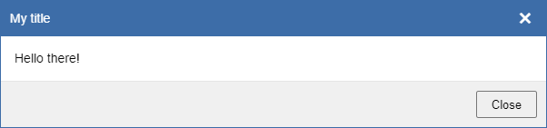

# EasyDialogBox
Easy to use Javascript dialog box!

Easily create a messagebox, alert, confirm, prompt, toast, or whatever you want to put in a dialog box.

 

## Features
- Plain vanilla Javascript, no libraries needed.
- Customizable
- Draggable
- Resizable
- Responsive
- Using standard Javascript (<a href="https://www.google.com/search?q=ecmascript+5" title="https://www.google.com/search?q=ecmascript+5">ES5</a>), HTML and CSS. Crossbrowser, trying to support legacy browsers as much as possible. 
- <a href="https://github.com/keejelo/EasyDialogBox/tree/master/js" title="Minified version, smaller size">Lightweight</a>

 

## How to use?
Documentation and live examples:
https://keejelo.github.io/EasyDialogBox/documentation.html

 

Below shows a very basic and simple example of how to create and show a dialogbox:
<pre>let myBox = EasyDialogBox.create('myId', 'dlg', 'My title', '&lt;p&gt;Hello there!&lt;/p&gt;');
myBox.show();</pre>

Produces this:

<i>This is the default style, but it can of course be customized as you wish with optional flags, and even further with css.</i>
  

See more examples: https://keejelo.github.io/EasyDialogBox/documentation.html#js_example

 

## Important changes
- <b>Version 1.735 and above:</b> 
  Removed parameter <code>bKeepAlive</code> from function: <code>EasyDialogBox.create(...);</code>
   
  Syntax is now: 
  <code>EasyDialogBox.create(id, strBoxTypeClass, strTitle, strMessage, fnCallback, x, y, w, h);</code>
  
   
  
- <b>Version 1.722 and above:</b> 
  The "classflags" below has had their names changed due to naming ambiguity causing bugs:
  - "<b>dlg-no-drag</b>" is now called "<b>dlg-disable-drag</b>"
  - "<b>dlg-no-btns</b>" is now called "<b>dlg-disable-btns</b>"
  - "<b>dlg-no-overlay</b>" is now called "<b>dlg-disable-overlay</b>"
  - "<b>dlg-no-footer</b>" is now called "<b>dlg-disable-footer</b>"

 

## Motivation
I started this when I needed a multipurpose dialogbox for my own projects. Not wanting to be dependant on any libraries, I wrote this dialogbox module using only plain Javascript. If anyone else finds this useful that's great.  
Although dialogboxes has got a "bad rap" in the web-world, I still think they have their use when used correctly and in the right settings.

 

## Credits
Thanks to <b>ray73864</b> for testing and feedback.

 

## License
MIT © keejelo
